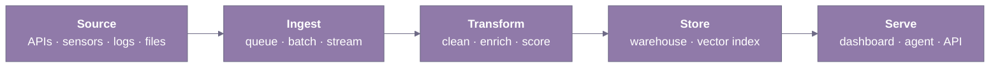

Third-year IT student at PCCOE Pune. I build AI agents and the data pipelines beneath them — the orchestration, evaluation, and backend glue that make a multi-agent system defensible to read, not just impressive to demo.

`github.com/Badal023` · `linkedin.com/in/BadalDadwani` · `badaldadwani@gmail.com`

---

### 🧭 About

I build systems end-to-end — from the data pipeline that feeds the model to the API another engineer will read next quarter. Most of my work sits at the intersection of agentic AI, data engineering, and the backend glue that keeps both honest.

I gravitate toward problems between research ideation and production shipping — multi-agent decision systems, applied ML pipelines, and integration debugging someone else didn't finish.

> [!TIP]
> Open to **summer 2026 internships** in data engineering, ML platform, or research engineering — anywhere I can ship code other engineers actually maintain.

---

### 🔭 Currently

- 🏗️ **Building — DecisionDNA**, a multi-agent decision-intelligence benchmark for agents reasoning under conflicting objectives, not single tasks.
- 🔁 **Iterating on — DecisionDNA's eval set**, targeting cases where agents over-commit to early subgoals — failure modes single-task benchmarks miss.
- 📚 **Reading — recent agent-evaluation papers on arXiv**, plus *Designing Data-Intensive Applications* (stream processing, consistency) through the lens of multi-agent orchestration.

---

### 🛠️ Selected Work

| Project | Stack | Outcome |
|---|---|---|
| **DecisionDNA** — multi-agent decision-intelligence benchmark | ![Python] ![LangGraph] ![ChromaDB] ![Neo4j] ![FastAPI]  + Slack/email/doc inputs | Stateful 7-agent workflow with advanced RAG over ChromaDB + Neo4j; surface-level eval shows where agents over-commit to early subgoals under conflicting objectives. |
| **Agentic Construction Intelligence** — multi-agent procurement / construction orchestration | ![Python] ![LangChain] ![LangGraph] ![FastAPI] ![MySQL] | Multi-agent state management for end-to-end procurement decisions; real REST APIs another service can integrate with. |
| **GridMind** — adaptive AI load balancing for micro-grids | ![Python]  RL libraries, forecasting models, power-systems datasets | RL + forecasting pipeline that rebalances load under simulated demand shifts; the project I use to test whether a "systems" claim holds up beyond software. |
| **CosmosX** — gamified Web3 education on Stellar Testnet | ![TypeScript] ![React] ![Stellar SDK] | Quest curriculum that walks learners through real testnet transactions; full-stack product, not a slide. |

---

### 🧩 Open Questions

> [!NOTE]
> Things I keep turning over in my notes — partly because they shape what I build next, partly because they show where the field still has open seams.

1. **How do you evaluate a multi-agent system with no single ground-truth answer?** Standard eval assumes one right answer; the right metric depends on what the system is actually for. DecisionDNA forces this every time I add a case.
2. **How does a fairness/robustness intervention avoid quietly breaking as the training distribution drifts?** Static interventions decay. My subgroup-robustness reproduction breaks the moment I shift the distribution — haven't found a writeup that solves both.
3. **What's the *first* useful observability signal for an agent orchestration layer?** ETL's "freshness-per-source" doesn't translate. Leaning toward *cost-per-successful-tool-call*, but still arguing myself out of it before committing.

---

### 🌀 Diagram

The shape most of my projects collapse into. I keep redrawing it until a project refuses to fit.

---

### 🧰 Stack

Tools I have actually shipped code on — not ones I have only read about.

| Layer | What I use |
|---|---|
| Languages | ![Python] ![TypeScript] ![SQL] ![Bash] |
| Agentic AI | ![LangChain] ![LangGraph] ![ChromaDB] ![Neo4j]  custom multi-agent state machines, tool-use patterns, custom eval harnesses |
| ML | ![PyTorch] ![scikit-learn] ![OpenCV]  basic RL libraries |
| Data | ![MySQL] ![Postgres] ![Pandas] ![DuckDB]  (DuckDB basic) |
| Backend | ![FastAPI] ![Flask]  REST API design, structured runbooks |
| Real-time | serial / IMU pipelines, basic signal processing (~20 Hz, multi-channel) |
| Web | ![React] ![Stellar SDK] |
| Infra | ![Docker] ![GitHub Actions] ![Linux] |

---

### 📡 Signals

- 💼 **Internships** — Trilliant Software (production REST APIs + runbooks for integration fixes, MySQL-compatible schemas); Infosys Springboard 6.0 (Python CV pipeline for PCB defect detection, ~25% accuracy lift across 5+ defect categories); Team Anantam Rocketry (real-time IMU pipelines across 5+ sensor channels at ~20Hz, ~30% error reduction over 10+ simulation cycles).
- 🏆 **Hackathons** — 🥇 1st at GDG on Campus Hackathon 2026 (ADYPU); 🥇 1st at Central India Hackathon 3.0 (top 100 of 800+); 🥈 2nd at Innovatex 4.0 (Presidency University, Bangalore).
- 🔬 **Research** — fairness & explainable AI: reproducible subgroup-robustness work, written up as a short report; currently iterating the reproduction under training-distribution shifts.
- 🎓 **Academics** — B.Tech IT, third year, PCCOE Pune; CGPA 7.9.
- 📜 **Certifications** — Red Hat RH124 (10.0), RH134 (9.3); DataCamp Data Engineer, Data Scientist, AI Engineer tracks.
- 🤝 **Activities** — Publicity Team, IT Student Association (ITSA), PCCOE.

---

### 📊 GitHub Stats

---

### 🗂️ More

📘 Selected Learning

- **DataCamp — Data Engineer Associate** — ETL pipelines, warehouse modelling, production data-quality patterns.
- **DataCamp — Data Engineering Track** — batch + streaming ingestion, orchestration, pipeline reliability.
- **DeepLearning.AI — Machine Learning Specialization** — Andrew Ng's sequence; re-grounded the applied ML side of the work.

📝 Notes and writeups

**Research**

- **Post-Hoc Minimax Weighting of Heterogeneous Classical Ensembles for Worst-Case Subgroup Robustness** — ongoing work focused on subgroup robustness, ensemble learning, explainable AI, minimax optimization, and evaluation methodology.

**Engineering Notes**

- **DecisionDNA — Design Notes** — internal notes documenting multi-agent orchestration, evaluation methodology, architecture decisions, agent communication, and iterative system design. These are design notes, not formal publications.

🐱 Morale Ping

 

For anyone who scrolled this far: reinforcement learning has nothing on this cat's exploration policy.

🎨 How this README was built

- Markdown rendered by GitHub; one Mermaid diagram for the part I keep re-explaining in conversation.
- Badges/icons from shields.io / simple-icons, tinted to one muted purple-and-slate palette.
- Header, footer, and stats cards generated on the fly (capsule-render, github-readme-stats, streak-stats) — no committed binary assets.
- Images-off readers still get the full story from headings, tables, and lists.

---

### 📬 Contact

Open to internships, OSS collaboration, and conversations about agents and pipelines that need to age well. Email reaches me fastest; LinkedIn for anything that wants a thread.

`badaldadwani@gmail.com` · `linkedin.com/in/BadalDadwani`

 

<!-- badge reference definitions — invisible, keeps the tables above readable -->
[Python]: https://img.shields.io/badge/Python-907AA9?style=flat-square&logo=python&logoColor=white
[TypeScript]: https://img.shields.io/badge/TypeScript-907AA9?style=flat-square&logo=typescript&logoColor=white
[SQL]: https://img.shields.io/badge/SQL-907AA9?style=flat-square
[Bash]: https://img.shields.io/badge/Bash-907AA9?style=flat-square&logo=gnubash&logoColor=white
[LangChain]: https://img.shields.io/badge/LangChain-6E6A86?style=flat-square&logo=langchain&logoColor=white
[LangGraph]: https://img.shields.io/badge/LangGraph-6E6A86?style=flat-square
[ChromaDB]: https://img.shields.io/badge/ChromaDB-6E6A86?style=flat-square
[Neo4j]: https://img.shields.io/badge/Neo4j-6E6A86?style=flat-square&logo=neo4j&logoColor=white
[FastAPI]: https://img.shields.io/badge/FastAPI-907AA9?style=flat-square&logo=fastapi&logoColor=white
[MySQL]: https://img.shields.io/badge/MySQL-6E6A86?style=flat-square&logo=mysql&logoColor=white
[PyTorch]: https://img.shields.io/badge/PyTorch-907AA9?style=flat-square&logo=pytorch&logoColor=white
[scikit-learn]: https://img.shields.io/badge/scikit--learn-907AA9?style=flat-square&logo=scikitlearn&logoColor=white
[OpenCV]: https://img.shields.io/badge/OpenCV-907AA9?style=flat-square&logo=opencv&logoColor=white
[Postgres]: https://img.shields.io/badge/Postgres-6E6A86?style=flat-square&logo=postgresql&logoColor=white
[Pandas]: https://img.shields.io/badge/Pandas-6E6A86?style=flat-square&logo=pandas&logoColor=white
[DuckDB]: https://img.shields.io/badge/DuckDB-6E6A86?style=flat-square&logo=duckdb&logoColor=white
[Flask]: https://img.shields.io/badge/Flask-907AA9?style=flat-square&logo=flask&logoColor=white
[React]: https://img.shields.io/badge/React-6E6A86?style=flat-square&logo=react&logoColor=white
[Stellar SDK]: https://img.shields.io/badge/Stellar%20SDK-6E6A86?style=flat-square&logo=stellar&logoColor=white
[Docker]: https://img.shields.io/badge/Docker-907AA9?style=flat-square&logo=docker&logoColor=white
[GitHub Actions]: https://img.shields.io/badge/GitHub%20Actions-907AA9?style=flat-square&logo=githubactions&logoColor=white
[Linux]: https://img.shields.io/badge/Linux-907AA9?style=flat-square&logo=linux&logoColor=white
