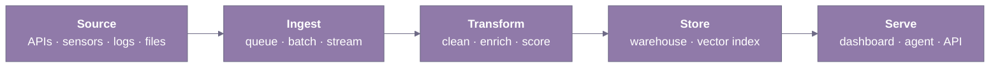

## Badal Dadwani

Third-year IT student at PCCOE Pune. I build AI agents and the data pipelines beneath them — the orchestration, evaluation, and backend glue that make a multi-agent system defensible to read, not just impressive to demo.

`github.com/Badal023` · `linkedin.com/in/BadalDadwani` · `badaldadwani@gmail.com`

---

### About

I build systems end-to-end — from the data pipeline that feeds the model to the API another engineer will read next quarter. Most of my work sits at the intersection of agentic AI, data engineering, and the backend glue that keeps both honest.

I gravitate toward problems where the answer isn't a paper — somewhere between research ideation and production shipping, where the work is forcing both sides to compromise honestly. That's what keeps pulling me into multi-agent decision systems, applied ML pipelines, and integration debugging that someone else didn't finish.

Open to **summer 2026 internships** in data engineering, ML platform, or research engineering — anywhere I can ship code other engineers actually maintain.

---

### Currently

- **Building — DecisionDNA**, a multi-agent decision-intelligence benchmark for evaluating how agents reason under conflicting objectives, not single tasks.
- **Iterating on — DecisionDNA's eval set**, specifically the cases where agents over-commit to early subgoals, and the failure modes that don't show up in single-task benchmarks.
- **Reading — agent-evaluation papers from the last six months on arXiv**, plus re-reading the *Designing Data-Intensive Applications* chapters on stream processing and consistency through the lens of multi-agent orchestration.

---

### Selected Work

| Project | Stack | Outcome |
|---|---|---|
| **DecisionDNA** — multi-agent decision-intelligence benchmark | Python, LangGraph, ChromaDB, Neo4j, FastAPI, Slack/email/doc inputs | Stateful 7-agent workflow with advanced RAG over ChromaDB + Neo4j; surface-level eval shows where agents over-commit to early subgoals under conflicting objectives. |
| **Agentic Construction Intelligence** — multi-agent procurement / construction orchestration | Python, LangChain, LangGraph, FastAPI, MySQL | Multi-agent state management for end-to-end procurement decisions; real REST APIs another service can integrate with. |
| **GridMind** — adaptive AI load balancing for micro-grids | Python, RL libraries, forecasting models, power-systems datasets | RL + forecasting pipeline that rebalances load under simulated demand shifts; the project I use to test whether a "systems" claim holds up beyond software. |
| **CosmosX** — gamified Web3 education on Stellar Testnet | TypeScript, React, Stellar SDK | Quest curriculum that walks learners through real testnet transactions; full-stack product, not a slide. |

---

### Open Questions

Things I keep turning over in my notes — partly because they shape what I build next, partly because they show where the field still has open seams.

1. **How do you evaluate a multi-agent system when there is no single ground-truth answer?** Standard eval assumes one right answer; multi-step decision-making is full of tradeoffs, and the right metric depends on what the agent system is actually for. DecisionDNA forces this question every time I add a case.
2. **How do you keep a fairness or robustness intervention from quietly breaking when the upstream training distribution drifts?** Static interventions decay; dynamic ones need their own monitoring loop. I've got a half-written reproduction of a subgroup-robustness baseline that breaks the moment I shift the training distribution, and I haven't seen a writeup that handles both.
3. **When does an agent orchestration layer earn observability, and what is the *first* useful signal?** Freshness-per-source doesn't translate from ETL the way I assumed it would. I'm currently leaning on something like *cost-per-successful-tool-call*, but I want to argue against that in writing before I commit to it as the dashboard's first metric.

---

### Diagram

The shape most of my projects collapse into. I keep redrawing it until a project refuses to fit.

---

### Stack

Tools I have actually shipped code on — not ones I have only read about.

| Layer | What I use |
|---|---|
| Languages | Python, TypeScript, SQL, Bash |
| Agentic AI | LangChain, LangGraph, custom multi-agent state machines, RAG (ChromaDB + Neo4j), tool-use patterns, custom eval harnesses |
| ML | PyTorch, scikit-learn, OpenCV, basic RL libraries |
| Data | MySQL, Postgres, Pandas, DuckDB (basic) |
| Backend | FastAPI, Flask, REST API design, structured runbooks |
| Real-time | serial / IMU pipelines, basic signal processing (~20 Hz, multi-channel) |
| Web | React, Stellar SDK |
| Infra | Docker, GitHub Actions, Linux |

---

### Signals

- **Internships** — Trilliant Software (production REST APIs + runbooks for integration fixes, MySQL-compatible schemas); Infosys Springboard 6.0 (Python CV pipeline for PCB defect detection, ~25% accuracy lift across 5+ defect categories); Team Anantam Rocketry (real-time IMU pipelines across 5+ sensor channels at ~20Hz, ~30% error reduction over 10+ simulation cycles).
- **Hackathons** — 1st at GDG on Campus Hackathon 2026 (ADYPU); 1st at Central India Hackathon 3.0 (top 100 of 800+); 2nd at Innovatex 4.0 (Presidency University, Bangalore).
- **Research** — fairness & explainable AI: reproducible subgroup-robustness work, written up as a short report; currently iterating the reproduction under training-distribution shifts.
- **Academics** — B.Tech IT, third year, PCCOE Pune; CGPA 7.9.
- **Certifications** — Red Hat RH124 (10.0), RH134 (9.3); DataCamp Data Engineer, Data Scientist, AI Engineer tracks.
- **Activities** — Publicity Team, IT Student Association (ITSA), PCCOE.

---

### More

Selected Learning

- **DataCamp — Data Engineer Associate** — hands-on track covering ETL pipelines, warehouse modelling, and production data-quality patterns.
- **DataCamp — Data Engineering Track** — broader track covering batch + streaming ingestion, orchestration, and pipeline reliability.
- **DeepLearning.AI — Machine Learning Specialization** — Andrew Ng's three-course sequence; re-grounded the applied ML side of the project work.

Notes and writeups

**Research**

- **Post-Hoc Minimax Weighting of Heterogeneous Classical Ensembles for Worst-Case Subgroup Robustness** — ongoing work focused on subgroup robustness, ensemble learning, explainable AI, minimax optimization, and evaluation methodology.

**Engineering Notes**

- **DecisionDNA — Design Notes** — internal notes documenting multi-agent orchestration, evaluation methodology, architecture decisions, agent communication, and iterative system design. These are design notes, not formal publications.

How this README was built

This page is intentionally small: plain Markdown first, one Mermaid diagram for the parts I keep re-explaining in conversation, and a single illustration at the bottom that has nothing to do with code.

- Markdown rendered by GitHub.
- Diagram rendered by GitHub's Mermaid pipeline.
- Icons, if any, fetched from `cdn.simpleicons.org` in a single muted color.
- No tracking, no widgets, no live counters, no external scripts.

If you read it with images disabled, you should still get the whole story.

---

<picture>
  <source media="(prefers-color-scheme: dark)" srcset="assets/footer-dark.png">
  
</picture>

### Contact

Open to internships, OSS collaboration, and conversations about agents and pipelines that need to age well. Email reaches me fastest; LinkedIn for anything that wants a thread.

`badaldadwani@gmail.com` · `linkedin.com/in/BadalDadwani`

Illustration by **{{artist or source — see assets/footer-source.md}}** · <em>notebooks for the parts of a system nobody else will write down</em>

 
